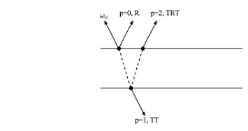

# Yocto/PathExtension: Hair Shading Project
- **Ivan Colantoni 1704031, Giulia Cassarà 1856973**

The goal of our project is to integrate the model implemented by [pbrt](https://www.pbrt.org/hair.pdf), suited for hair rendering in production , in the Yocto library. In the following report we proceed to present a brief introduction to the problem, the steps that we take in order to make work the implementation, the results obtained, some comments and evaluations of the performances. 

## Introduction [pbrt](https://www.pbrt.org/hair.pdf)

Hair modeling in graphics is a demanding task. The geometric complexity of fibers and the singular way the light is scattered from this material make realistic hair rendering a computationally hard task. Nevertheless some models implemented on physically-based renderer work reasonably well, but either make the resulting outputs difficult to control for artists, or sometimes are more focused on some *had hoc* solutions that make it impossible to generalize. 
In this model these problems are addressed, and the solution is made effective on the following contributions:
* The implementation of a single-based fiber scattering model that allows for efficient Monte Carlo rendering of path-traced multiple fiber scattering.
* A reparameterization of the absorption coefficient and roughnessparameters that is more intuitive for artists and enables efficientartist workflow, while remaining physically consistent.

## Implementation 
**Integration to Yocto/yocto_trace.cpp** 
We followed the implementation made by the authors of the paper [pbrt-v3/hair.cpp](https://github.com/mmp/pbrt-v3/blob/master/src/materials/hair.cpp). First of all we needed to include a library: 

    #include <numeric>

then we defined the costant geometric parameters of the model :

    static const int pMax = 3;        //number of segments of scattered light
    static const float eta = 1.55f;   // the index of refraction of the interior of the hair
    static const float beta_m = 0.3f; //the longitudinal roughness of the hair
    static const float beta_n = 0.3f; //the azimuthal roughness
    const float h = 0.0f;               //offset along the curve width where the ray intersected theoriented ribbon  
    float sin2kAlpha[3], cos2kAlpha[3]; //the angle that the small scales on the surface of hair are offset fromthe base cylinder
    float v[pMax + 1];
    static const float SqrtPiOver8 = 0.626657069f;

Moreover, some general utility functions are defined for better performances. 

There are a few quantities related to the directions ωo and ωi that are needed for evaluating the hair scattering model. Specifically, the sine and cosine of the angle θ that each direction makes with the plane perpendicular to the curve, and the angle φ in the azimuthal coordinate system.
Incident light arriving at a hair may be scattered one more times before leaving the hair. They used to denote the number of path segments it follows inside the hair before being scattered back out to air. For instance p= 0 corresponds to R, for reflection, p= 1 is TT, for two transmissions p= 2 is TRT,p= 3 is TRRT, and so forth.

It has been useful to consider these scattering modes separately and so the hair BSDF is written as a sum over the terms p

*f(ωo, ωi) = (p=0,∞)∑fp(ωo, ωi)*

To make the scattering model implementation and sampling easier, many hair scattering models factor *f* into terms where one depends only on the angles *θ* and another on *φ*, the difference between *φo* and *φi*. This semi-separable model is given by:

*fp(ωo, ωi) =Mp(θo, θi)Ap(ωo)Np(φ)/|cosθ|*

Where :

**1. *Mp* = longitudinal scattering function**

**2. *Ap* = attenuation function,**

**3. *Np* = azimuthal scattering function**

Given the incoming and outcoming directions, the angle *φo* in the perpendicular plane can be computed with std::atan (and the same for *φi*) : 

    static vec3f f(const vec3f& wo, const vec3f& wi) {
    // Compute hair coordinate system terms related to _wo_
    float sinThetaO = wo.x;
    float cosThetaO = sqrt(1 - Sqr(sinThetaO));
    float phiO      = std::atan2(wo.z, wo.y);

**1. Longitudinal Scattering Mp**

For longitudinal scattering **Mp** the model implemented here was developed by d’Eon et al. (2011). Although it turned out that this model isn't numerically stable for low roughness variance *v*, which is parametric controlled in that case. Then, the *v <= .1* test in the implementation below selects between the two formulations:

    static float Mp(float cosThetaI, float cosThetaO, float sinThetaI,
    float sinThetaO, float v) {
        float a = cosThetaI * cosThetaO / v;
        float b = sinThetaI * sinThetaO / v;
        float mp = (v <= .1) //test on roughness value.
            ? (std::exp(LogI0(a) - b - 1 / v + 0.6931f + std::log(1 / (2 * v))))
            : (std::exp(-b) * I0(a)) / (std::sinh(1 / v) * 2 * v);
     return mp;
    }

Different roughness values are used for different values of *p*. For *p*= 1, roughness is reduced by an empirical factor that models the focusing of light due to refraction through the circular boundary of the hair.

    // Sample $M_p$ to compute $\thetai$
    v[0] = (0.726f * beta_m + 0.812f * beta_m * beta_m + 3.7f * Pow<20>(beta_m)) *
            (0.726f * beta_m + 0.812f * beta_m * beta_m + 3.7f * Pow<20>(beta_m));
    v[1]    = .25 * v[0];
    v[2]    = 4 * v[0];
    v[3]    = v[2]   //for p = 3 and above v[p]=v[2]

**2. Attenation Function Ap**

The **Ap** term describes how much of the incident light is affected by each of the scattering modes *p*. This absorption is what gives hair and fur its color. The *Ap* function, that the authors implement, models all reflection and transmission at the hair boundary as perfectly specular. This simplifies the implementation and give reasonable results. Here we provide the pseudocode as it is meant to be integrated in the code : 
    
    
    〈Hair Local Functions〉 
     Ap(Float cosThetaO,Float eta,Float h, const Spectrum &T) {std::array<Spectrum, pMax + 1> ap;
    〈Compute p= 0 attenuation at initial cylinder intersection〉
    〈Compute p= 1 attenuation term〉
    〈Compute attenuation terms up top=pMax〉
    〈Compute attenuation term accounting for remaining orders of scattering〉
    return ap;
    }

.... specify the code in the pseudo-code

**3. Azimuthal Scattering Np**

This model covers the scattering part that depends on the angle *φ*. First we need to knwo how an incident ray is deflected by specular reflection and trasmission in the normal plane. This is done by the function: 

    inline Float Phi(int p, Float gammaO, Float gammaT) 
        {return 2 * p * gammaT - 2 * gammaO + p * Pi;}     

Then a logistic distribution function is used to model the scattering effect of the roughness surface. In particular, the logistic distribution is normalized and defined usually on the interval [−π, π], but for flexibility it takes values over the range [a, b]. It's called *Trimmed Logistic* .

    inline float Np(Float phi, int p, Float s, Float gammaO,Float gammaT) {
        float dphi = phi - Phi(p, gammaO, gammaT);
        〈Remap dphi to[−π, π]〉
        return TrimmedLogistic(dphi, s, -Pi, Pi);

**Modelling Scales and evaluating the model**
This is the last step before making the whole constructors working together. For the R terms, the presence of such angle *α* can be modelled by adding the value *2α*
to the previous value. For the term TT, p=1, the angle is rotated in the opposite direction by *α*, to compensate the double transmittance effect. Finally for TRT a rotation by -*4α* works well for the whole effect.

Now that all the pieces are made up, evaluating the model is straightforward because, as specified before, having *factorized* the model in semi-separable modules give us now the opportunity to evaluate the functions defined for each and sum up the individuals terms *fp*. 

    〈Evaluate hair BSDF〉 
    float phi = phiI - phiO;
    std::array<Spectrum, pMax + 1> ap = Ap(cosThetaO, eta, h, T);
    Spectrum fsum(0.);
    for (int p = 0; p < pMax; ++p) {〈
        Computesinθiandcosθiterms accounting for scales〉
        fsum += Mp(cosThetaIp, cosThetaO, sinThetaIp, sinThetaO,v[p]) *     //1.
                Ap[p] *                                                     //2.
                Np(phi, p, s, gammaO, gammaT);                              //3.
    }
    〈Compute contribution of remaining terms afterpMax〉
    if (AbsCosTheta(wi) > 0) fsum /= AbsCosTheta(wi);
    return fsum;

## Results

The results that we have obtained show took in average:
* 1min for those in low-resolution (256x720)
* 7/8 min for those in high-resolution (1024x1280)

results

Note that playing with absorption coefficients sigma={sr,sg,sb} it has been possible to obtain different pigment of the hair with very realistic look.
We noticed that for some reasons when the number of segments considered for scattering ,*p*, increases, the output will be rendered faster and tend to be smoother, but the lighting effect will result darker and more difficult to control. 

## Conclusions 